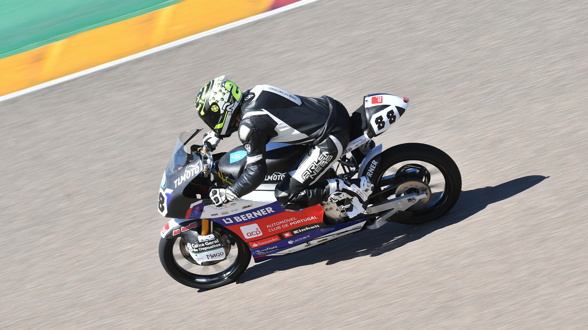
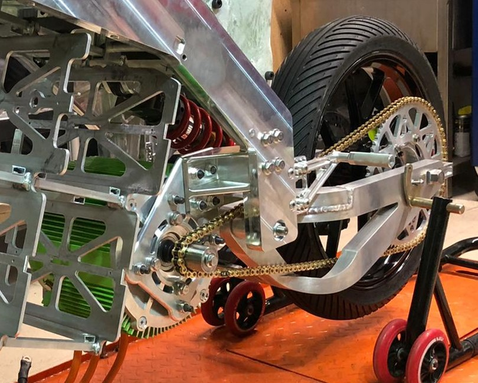
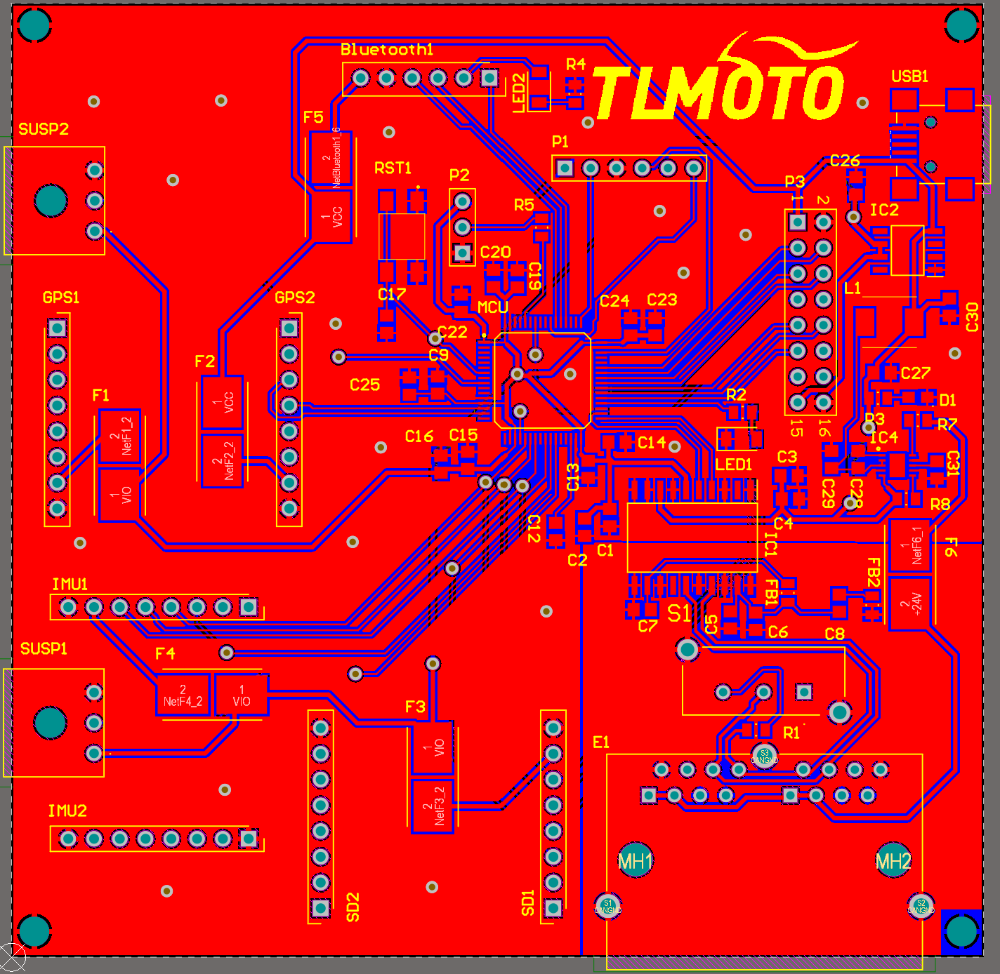

# Telemetry System for TLM03e and TLM04e

In automotive racing, every second counts when it comes to winning a race. If the pilot brakes too early or makes too wide of a turn, they risk being overtaken and loosing the advantage. Thus, it is of major interest to be aware of how the vehicle behaves on track. In professional automotive sports, such as Formula 1 and MotoGP, the teams resort to the use of telemetry to improve machine and rider performance. 
This project refers to the telemetry system developed for an electric racing motorcycle prototype, built by Portuguese students at Instituto Superior Técnico (IST). 
[TLMoto](https://tlmoto.tecnico.ulisboa.pt/) is a team made of students, mainly from IST, which is dedicated to projecting, building and racing electric motorcycles for international competitions around the world, like the one shown in the figure bellow.

This telemetry system is equipped with various sensors and communicates with the other sub-systems within the motorcycle, in order to collect and log as much information as possible. This piece of equipment has allowed the team at TLMoto to better understand the behavior of the prototype, advise the rider and also to troubleshoot other parts of the vehicle.

## What is telemetry?
Telemetry is the measurement of data from a distant object or vehicle, and, in many cases, the transmission of those measurements to a ground-station or database. However, all the competitions (like MotoStudent :tm:, Moto Engineering Italy:tm:, etc.) prohibit the use of live telemetry data transmission, as is the case of the professional MotoGP. As stated on the official regulation documents of those competitions, the telemetry data obtained from the prototype must only be acquired during pit-stops. 

The telemetry acquisition is a very important sub-system of the prototype, as it allows the team to have an accurate description of its behaviour in tests and races, as well as to provide feedback and suggestions to the pilot. It also plays a big roll in understanding what could be altered on the current prototype or what could be improved on the next one.

## Project Description and Requirements
This system is intended to measure, manage, store and finally transmit all the acquired data, which is then sent to an external computer to be properly processed and displayed to the pit crew. The objective is to extract the maximum of useful data to accurately characterize the prototype, while avoiding to overload the system. For this reason, not only the physical quantities to obtain must be chosen wisely, but also the system must be fast and robust so the loss of information is minimal. It should collect information about the dynamic, mechanical, electrical and thermal aspects of the motorcycle, as well as the control inputs given by the pilot, in order to observe how the prototype actually responds to commands and compare it with the expected response.

The most important items to quantify are: velocity, accelerations, RPM, suspension travel, temperatures of the motor and controller, temperatures of the battery packs, voltages of the battery packs, current from the battery, accelerator and brakes inputs and position over time so the parameters can be analysed along the track. Some other values that are obtained are, for example: phasor components of the motor current ($I_d$, $I_q$), torque, handlebar steering angle, roll and pitch angles, among others. 

As per the data logging and retrieving, all the acquired values are stored during the laps in an SD card, that can be conveniently removed and plugged in to a computer. Alternatively to the removal of the SD card, the content of the telemetry may be transmitted to the computer via Bluetooth, using the Bluetooth 5.0 module included in the system's last iteration. This is done as such because, as mentioned earlier, distant communication is not allowed by the regulation and the retrieving of the data must be done only within the premises of the box.

## Sensors and other components
Before specifying what sensors to get, it is best to figure what is already available in the prototype that can provide information about the parameters mentioned in the previous section.

### Controller
One very important component for our motorcycle and any other electric vehicle is the controller, which is used as an interface between the accumulator and the motor. The TLM03e uses a \emph{Sevcon Gen4 Size 6} controller to turn the 126V of direct current from the battery into three-phase AC voltage for the motor. This device is able to control and measure the motor's rotations per minute (RPM), torque and currents, as well as to keep track of the temperatures of the motor and the controller itself. All those parameters are sent to the CAN bus (Controller Area Network) that connects all the sub-systems of the Low Voltage System and then received by the telemetry module. 

### Battery Management System (BMS)
The accumulator is a set of many battery cells in series and parallel configurations. The one in TLM03e is divided in five battery packs, each made of six sets of cells, and they must be constantly monitored and balanced between each other. This task is accomplished by yet another sub-system called BMS (Battery Management System). The BMS measures the voltage of every individual set of cells and the temperature in three points of every pack. The voltage and temperature values obtained by the BMS are sent to the CAN bus.

### Sensors On-board
The position coordinates of the motorcycle along the track are collected by a GPS module. The chosen module was a GPS 4 Click from MikroE, which has a reasonably good accuracy and can provide an update rate of up to 10 Hz. It outputs messages in the NMEA format with information about the coordinates, UTC time and estimated velocity. We use a "mouse" antenna outside the carbon fiber fairing to avoid RF shielding.

The accelerations and rotation angles -- mainly from pitch and roll -- acting on the motorcycle are measured by an Inertial Measurement Unit, or  IMU, based on the ICM-20948 microchip. It includes a three axis accelerometer, a three axis gyroscope and a three axis magnetometer, thus providing nine degrees of freedom.

The suspension travel is obtained with the use of two linear potentiometers, one for the front suspension and one for rear one. A linear potentiometer translates a variable resistance into a linear displacement. This solution requires constant contact between the wiper and the resistive path, which may reduce durability due to friction. An alternative would be a LVDT, however this uses AC signals, requiring more complex implementation on the circuit.

The accelerator handle includes a rotary potentiometer in order to measure the acceleration inputs from the pilot. Its terminals are directly connected to the controller as this is what will determine the mechanical power requested to the motor. The value corresponding to the accelerator knob is also sent to the telemetry system via CAN.

It is noteworthy to mention that our prototype does not have a gearbox, much like the vast majority of electric vehicles, meaning that the linear velocity can very easily be calculated from the motor RPM. This is due to the direct link between the motor shaft and the wheel sprocket, as shown in the figure below. In fact, the velocity is directly proportional to the RPM according to the following expression: 

$$ v[km/h] = \frac{rpm\times2\pi\times r_{wheel}}{60}\times R_G\times \frac{3600}{1000}     $$

where $r_{wheel}$ is the outer radius of the tire and $R_G$ is the gear ratio used for this conversion.

## PCB

